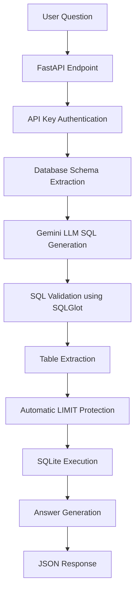
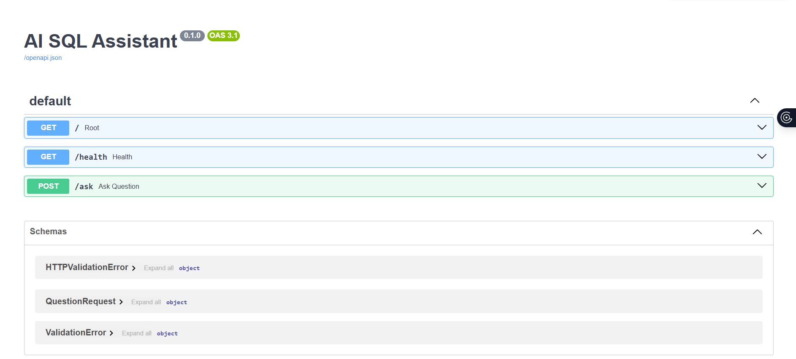

# AI SQL Assistant

AI SQL Assistant is a FastAPI-based backend service that lets non-technical users ask business questions in natural language and receive safe, read-only answers from a SQLite database. The system converts a question into SQL with Google Gemini, validates the generated query with SQLGlot, executes it against SQLite, and returns both structured JSON results and a plain-English answer.

## Project Overview

This project was built as an AI Engineer Intern take-home assignment focused on practical LLM orchestration, SQL safety, and API design. The goal is to make database analysis accessible while preventing unsafe or destructive queries from reaching the database.

### Core Application Flow



plain text version
User Question
      ↓
FastAPI Endpoint
      ↓
API Key Authentication
      ↓
Schema Extraction
      ↓
Gemini SQL Generation
      ↓
SQLGlot Validation
      ↓
Table Extraction
      ↓
SQLite Execution
      ↓
Answer Generation
      ↓
JSON Response
```


## Technology Stack

- Python
- FastAPI
- SQLite
- Google Gemini API
- SQLGlot
- Pydantic
- python-dotenv
- Uvicorn

## Repository Structure

```text
LLM_sparkline/
|-- code/
|   |-- auth.py
|   |-- answer_generator.py
|   |-- config.py
|   |-- database.py
|   |-- llm.py
|   |-- main.py
|   |-- models.py
|   |-- prompts.py
|   |-- validator.py
|-- sparkline_demo.db
|-- requirements.txt
`-- README.md
```

## Features

- Natural-language-to-SQL question answering
- Google Gemini-powered SQL generation
- Dynamic schema extraction from SQLite
- SQLGlot-based SQL validation
- Read-only enforcement for analytics use cases
- Automatic `LIMIT` protection for generated queries
- API key authentication using the `X-API-Key` header
- JSON output with both structured results and a business-friendly answer

## Setup Instructions

### 1. Clone the repository

```bash
git clone <repository-url>
cd LLM_sparkline
```

### 2. Create a virtual environment

```bash
python -m venv .venv
```

### 3. Activate the virtual environment

On Windows PowerShell:

```bash
.venv\Scripts\Activate.ps1
```

On Windows Command Prompt:

```bash
.venv\Scripts\activate.bat
```

### 4. Install requirements

```bash
pip install -r requirements.txt
```

### 5. Create a `.env` file

Create a file named `.env` in the project root.

### 6. Add your environment variables

```env
GEMINI_API_KEY=your_gemini_api_key_here
API_KEY=sparkline-secret-key
```

### 7. Run the application

```bash
uvicorn code.main:app --reload
```

### 8. Open Swagger UI

Visit:

[http://127.0.0.1:8000/docs](http://127.0.0.1:8000/docs)

### SCREENSHOT

## API Documentation



## API Authentication

All protected endpoints require the `X-API-Key` header.

Example:

```http
X-API-Key: sparkline-secret-key
```

## API Endpoints

### `GET /`

Returns the service status.

Example response:

```json
{
	"message": "AI SQL Assistant Running"
}
```

### `GET /health`

Returns a health check response.

Example response:

```json
{
	"status": "healthy"
}
```

### `POST /ask`

Accepts a natural language business question and returns the generated SQL, the tables used, the query results, and a concise answer.

Example request:

```json
{
	"question": "Who are the top 5 customers by revenue?"
}
```

Required header:

```http
X-API-Key: sparkline-secret-key
```

Example successful response:

```json
{
	"question": "Who are the top 5 customers by revenue?",
	"sql": "SELECT c.name, SUM(s.amount) AS revenue ...",
	"tables_used": ["customers", "sales"],
	"result": [
		{
			"name": "HCL Infosystems",
			"revenue": 488000
		}
	],
	"answer": "HCL Infosystems is the highest revenue customer."
}
```

## Sample Runs

### Sample Run 1

Question:

```text
Who are the top 5 customers by revenue?
```

Response:

```json
{
	"question": "Who are the top 5 customers by revenue?",
	"sql": "SELECT c.name, SUM(s.amount) AS revenue FROM customers AS c JOIN sales AS s ON c.id = s.customer_id GROUP BY c.id, c.name ORDER BY revenue DESC LIMIT 5",
	"tables_used": ["sales", "customers"],
	"result": [
		{
			"name": "HCL Infosystems",
			"revenue": 488000
		},
		{
			"name": "Flipkart Wholesale",
			"revenue": 376000
		},
		{
			"name": "Croma Retail",
			"revenue": 334000
		},
		{
			"name": "Reliance Digital",
			"revenue": 311500
		},
		{
			"name": "Govt IT Department",
			"revenue": 228000
		}
	],
	"answer": "The top 5 customers by revenue are HCL Infosystems (₹488,000), Flipkart Wholesale (₹376,000), Croma Retail (₹334,000), Reliance Digital (₹311,500), and Govt IT Department (₹228,000)."
}
```

### Sample Run 2

Question:

```text
What is the average employee salary?
```

Response:

```json
{
	"question": "What is the average employee salary?",
	"sql": "SELECT AVG(salary) AS average_salary FROM employees LIMIT 100",
	"tables_used": ["employees"],
	"result": [
		{
			"average_salary": 1025000
		}
	],
	"answer": "The average employee salary is ₹1,025,000."
}
```

### Sample Run 3: Refused Request

Question:

```text
Delete all customers
```

Response:

```json
{
	"question": "Delete all customers",
	"sql": null,
	"tables_used": [],
	"result": [],
	"answer": "Only read-only analytical questions are supported."
}
```

## Design Decisions

### Why FastAPI was chosen

FastAPI provides a modern, high-performance way to build APIs with automatic validation, interactive Swagger documentation, and clean dependency injection. That makes it a strong fit for an AI-backed service with a small, well-defined set of endpoints.

### Why Gemini was chosen

Google Gemini was used as the LLM because it can translate business questions into SQL and summarize results into plain English while keeping the implementation straightforward. The project uses Gemini 2.5 Flash for a balance of speed and quality.

### Why SQLGlot was chosen

SQLGlot parses SQL into an AST, which makes it much safer than relying on string matching alone. It allows the application to verify that the model produced a single SELECT statement and to inspect the tables used before execution.

### Why API key authentication was implemented

The service is meant to be a controlled internal analytics tool, not a public anonymous endpoint. Simple API key protection is enough for the take-home assignment and prevents casual unauthorized access.

### Why schema extraction is dynamic

The schema is read from SQLite at runtime so the model receives the current database structure instead of a hard-coded snapshot. This keeps the application aligned with the real database and reduces prompt drift when schema changes.

### Why LLM-generated SQL is treated as untrusted input

LLMs can produce incorrect, incomplete, or unsafe SQL even when prompted carefully. Treating the output as untrusted input is the correct security model because validation must happen before any query reaches the database.

## Prompt Design

The SQL generation prompt is intentionally restrictive:

- Only `SELECT` queries are allowed
- No `INSERT`, `UPDATE`, `DELETE`, or other mutating statements
- No multiple SQL statements
- Use only the provided schema
- Return SQL only
- Use meaningful aggregation aliases when appropriate

This reduces the chance of unsafe output and improves the reliability of downstream validation.

## Security

The project includes multiple layers of protection:

1. API key authentication via the `X-API-Key` header
2. Read-only SQL enforcement in the application flow
3. SQLGlot AST validation before execution
4. Blocking of multiple SQL statements
5. Table whitelist validation against approved tables only
6. Automatic `LIMIT` protection when the model does not include one
7. Refusal of modification requests before SQL generation

These safeguards work together to reduce the risk of destructive or unauthorized database access.

## Assumptions

- The database schema is trusted
- Users ask analytical questions
- The application only permits read-only analytical queries through SQL validation and application-level safeguards.
- Gemini has access only to schema information, not arbitrary database credentials or direct database access

## Limitations

- LLM output may vary between requests
- Highly ambiguous questions may produce imperfect SQL
- No conversational memory is implemented
- The backend supports SQLite only
- No user role management is included
- No caching layer is implemented
- The system currently performs keyword-based rejection for modification requests before LLM generation. A production-grade implementation would use intent classification or policy enforcement models for more robust handling.

## Future Improvements

- Support additional databases
- Add query caching
- Add role-based access control
- Add a query explanation feature
- Migrate to the latest Google GenAI SDK
- Add a frontend dashboard
- Add query history and analytics
- Add streaming responses

## Tools and Resources Used

- Gemini API
- FastAPI documentation
- SQLGlot documentation
- SQLite documentation
- Python official documentation

## Rejected Approach

I considered executing LLM-generated SQL directly, but rejected this approach because it would create security risks. Instead, SQLGlot-based validation was implemented to ensure only safe read-only queries are executed.

## One-Line Note

LLM Provider: Google Gemini 2.5 Flash with SQLGlot-based SQL validation.

